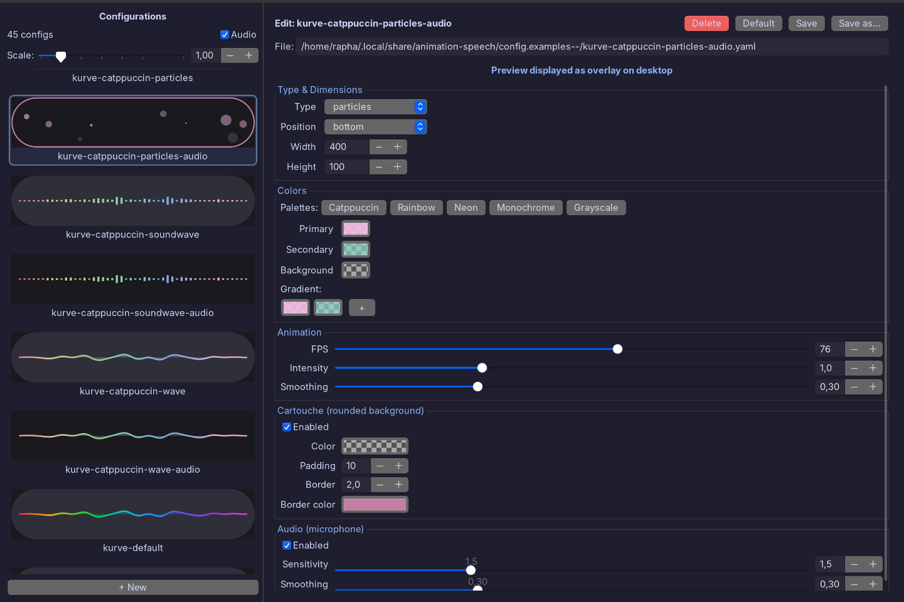

# Animation Speech — Speech overlay for Wayland

A configurable transparent overlay for Wayland that displays visual animations during speech controlled via UNIX signals (SIGUSR1/SIGUSR2), making it easy to integrate with any TTS, STT, or audio backend.



## How it works

```
┌──────────────┐     SIGUSR1      ┌──────────────────┐
│  Your app    │ ──────────────── │  animation-speech │
│  (TTS, STT)  │     SIGUSR2      │  (Wayland overlay)│
└──────────────┘ ──────────────── └──────────────────┘
      Speaking → start                Animation visible
      Silence  → stop                 Animation hidden
```

The animation runs as an independent background process. Your application simply sends:

- `SIGUSR1` to start the animation (voice is speaking)
- `SIGUSR2` to stop the animation (silence)

## Features

- **True Wayland overlay** via gtk-layer-shell (not a regular window)
- **Fully transparent** — only the animation is visible
- **8 animation types**: wave, equalizer, soundwave, soundwave-curve, circular, circular-wave, circular-bars, particles
- **Rounded background** — optional semi-transparent capsule-style backdrop
- **Microphone modulation** — animation reacts to microphone input via PyAudio (optional)
- **Mute detection** — automatic warning if microphone is muted (PulseAudio/PipeWire/ALSA)
- **Multi-format colors** — hex (`#ED8796`, `#ED8796F2`), short hex (`#F00`), or float arrays
- **Visual selector** — `--choose` to preview and pick configurations interactively
- **9 screen positions** — bottom, top, center, top-left, top-right, etc.
- **i18n** — English and French

## Installation

### Debian/Ubuntu (.deb package)

```bash
sudo dpkg -i animation-speech_1.2.0_all.deb
sudo apt-get install -f   # install missing dependencies
```

### Generic tarball (any distro)

```bash
tar xzf animation-speech-1.2.0.tar.gz
cd animation-speech-1.2.0
./install.sh              # user install (~/.local)
./install.sh --system     # system-wide install (/usr/local, needs sudo)
./install.sh --uninstall  # uninstall
```

### From source

```bash
git clone https://github.com/rapha/animation-speech.git
cd animation-speech
./animation-speech.py     # run directly (dev mode)
# or
make build                # build zipapp → animation-speech.pyz
./install.sh              # install
```

### Dependencies

**Debian/Ubuntu:**

```bash
sudo apt install python3-gi python3-gi-cairo gir1.2-gtk-3.0 python3-yaml \
                 gtk-layer-shell gir1.2-gtklayershell-0.1

# Optional: microphone modulation
sudo apt install python3-pyaudio
```

**Arch Linux:**

```bash
sudo pacman -S python-gobject gtk3 python-yaml gtk-layer-shell
# Optional: sudo pacman -S python-pyaudio
```

**Fedora:**

```bash
sudo dnf install python3-gobject gtk3 python3-pyyaml gtk-layer-shell
# Optional: sudo dnf install python3-pyaudio
```

> **Note:** Without gtk-layer-shell, the program falls back to a regular window instead of a transparent overlay.

## Quick start

```bash
# Launch the animation (waits for signals)
animation-speech &

# Start the animation
kill -SIGUSR1 $(cat /tmp/speech-animation.pid)

# Stop the animation
kill -SIGUSR2 $(cat /tmp/speech-animation.pid)

# Quit
kill $(cat /tmp/speech-animation.pid)
```

Or use the control script:

```bash
animation-speech-ctl start    # SIGUSR1
animation-speech-ctl stop     # SIGUSR2
animation-speech-ctl quit     # SIGTERM
animation-speech-ctl status   # show current state
```

## Integration examples

The main use case is displaying an animation while a TTS engine speaks, or while an STT engine listens. Here's how to integrate `animation-speech` with various backends.

### Bash + Piper TTS

```bash
#!/bin/bash
# tts-speak.sh — Text-to-speech with animation

TEXT="$1"
PID_FILE="/tmp/speech-animation.pid"

# Start the overlay if not already running
if [ ! -f "$PID_FILE" ] || ! kill -0 "$(cat "$PID_FILE")" 2>/dev/null; then
    animation-speech &
    sleep 0.3  # let the overlay initialize
fi

ANIM_PID=$(cat "$PID_FILE")

# Start animation
kill -SIGUSR1 "$ANIM_PID"

# Speak (replace with your TTS engine)
echo "$TEXT" | piper --model en_US-lessac-medium --output-raw | aplay -r 22050 -f S16_LE -q

# Stop animation
kill -SIGUSR2 "$ANIM_PID"
```

```bash
./tts-speak.sh "Hello, this is a speech synthesis test"
```

### Bash + espeak-ng

```bash
#!/bin/bash
# tts-espeak.sh — espeak-ng with animation

PID_FILE="/tmp/speech-animation.pid"
animation-speech &
sleep 0.3

ANIM_PID=$(cat "$PID_FILE")

speak() {
    kill -SIGUSR1 "$ANIM_PID"
    espeak-ng -v en "$1"
    kill -SIGUSR2 "$ANIM_PID"
}

speak "First sentence."
sleep 1
speak "Second sentence after a pause."

# Quit the animation
kill "$ANIM_PID"
```

### Python + gTTS

```python
#!/usr/bin/env python3
"""TTS with animation-speech — Python example."""

import os
import signal
import subprocess
import time

from gtts import gTTS

PID_FILE = "/tmp/speech-animation.pid"

def get_animation_pid():
    """Read the running animation PID."""
    try:
        with open(PID_FILE) as f:
            pid = int(f.read().strip())
        os.kill(pid, 0)  # check process exists
        return pid
    except (FileNotFoundError, ValueError, ProcessLookupError):
        return None

def start_animation():
    """Launch animation-speech in the background."""
    subprocess.Popen(["animation-speech"])
    time.sleep(0.3)
    return get_animation_pid()

def speak(text, lang="en", anim_pid=None):
    """Synthesize and play text with animation."""
    if anim_pid is None:
        anim_pid = get_animation_pid()

    # Generate audio
    tts = gTTS(text=text, lang=lang)
    tts.save("/tmp/tts_output.mp3")

    # Start animation
    os.kill(anim_pid, signal.SIGUSR1)

    # Play audio
    subprocess.run(["mpv", "--no-video", "/tmp/tts_output.mp3"],
                   stdout=subprocess.DEVNULL, stderr=subprocess.DEVNULL)

    # Stop animation
    os.kill(anim_pid, signal.SIGUSR2)

if __name__ == "__main__":
    pid = start_animation()
    speak("Hello, this is a speech synthesis test.", anim_pid=pid)
    time.sleep(1)
    speak("The animation adapts automatically.", anim_pid=pid)
    os.kill(pid, signal.SIGTERM)  # quit the animation
```

### STT (speech-to-text) recording

The animation can also indicate when an STT engine is listening:

```bash
#!/bin/bash
# stt-record.sh — Recording with animation + Escape to cancel

# --on-escape: if the user presses Escape, cancel the recording
animation-speech --on-escape "kill $$ && rm -f /tmp/recording.wav" &
sleep 0.3

ANIM_PID=$(cat /tmp/speech-animation.pid)

# Show animation while recording
kill -SIGUSR1 "$ANIM_PID"

# Record (using ffmpeg, arecord, or any tool)
arecord -d 5 -f cd /tmp/recording.wav

# Stop animation
kill -SIGUSR2 "$ANIM_PID"
kill "$ANIM_PID"

# Transcribe with Whisper
whisper /tmp/recording.wav --language en --model small
```

### Conversational loop (STT + TTS)

```bash
#!/bin/bash
# assistant.sh — Conversational loop with animation

animation-speech -a &  # -a: microphone modulation (animation reacts to voice)
sleep 0.3
ANIM_PID=$(cat /tmp/speech-animation.pid)

while true; do
    echo "=== Listening... ==="
    kill -SIGUSR1 "$ANIM_PID"

    # Record 5 seconds
    arecord -d 5 -f cd /tmp/input.wav 2>/dev/null

    kill -SIGUSR2 "$ANIM_PID"

    # Transcribe
    TEXT=$(whisper /tmp/input.wav --language en --model small 2>/dev/null | tail -1)
    echo "You: $TEXT"

    [ "$TEXT" = "quit" ] && break

    # Generate a response (replace with your LLM)
    RESPONSE="You said: $TEXT"

    # Speak the response with animation
    kill -SIGUSR1 "$ANIM_PID"
    espeak-ng -v en "$RESPONSE"
    kill -SIGUSR2 "$ANIM_PID"

    echo "Assistant: $RESPONSE"
done

kill "$ANIM_PID"
```

## Configuration

Main config file: `config.yaml`

```yaml
animation_type: wave       # wave, equalizer, soundwave, soundwave-curve,
                           # circular, circular-wave, circular-bars, particles
position: bottom           # bottom, top, center, top-left, top-right, etc.
width: 800
height: 60

colors:
  background: "#00000000"              # Transparent
  primary: "#ED8796"                   # Hex RGB
  secondary: "#8AADF4F2"              # Hex RGBA
  gradient:                            # Optional gradient
    - "#ED8796F2"
    - "#EED49FF2"
    - "#A6DA95F2"
    - "#8BD5CAF2"

background:                            # Rounded backdrop (optional)
  enabled: true
  color: [0.2, 0.2, 0.25, 0.85]
  padding: 10
  border_width: 2
  border_color: "#FFFFFF80"

audio:                                 # Microphone modulation (optional)
  enabled: false
  sensitivity: 1.5
  smoothing: 0.3

animation:
  fps: 60
  bar_count: 20
  smoothing: 0.3
  intensity: 1.0
```

### Color formats

| Format      | Example                    | Alpha         |
| ----------- | -------------------------- | ------------- |
| Hex RGB     | `"#ED8796"`                | 1.0 (default) |
| Hex RGBA    | `"#ED8796F2"`              | Included      |
| Short hex   | `"#F00"`                   | 1.0 (default) |
| Float array | `[0.93, 0.53, 0.59, 0.95]` | Included      |

### Example configs

Configs are in `config.examples/` (with audio) and `config.examples/no-audio/`.

```bash
# List all available configs
animation-speech --list

# Use a config by name
animation-speech monochrome-bw
animation-speech kurve-catppuccin-wave-audio

# Interactive visual selector
animation-speech --choose
animation-speech --choose kurve    # filter
```

## Command-line options

```
animation-speech [config] [OPTIONS]

Options:
  -w, --width PX         Animation width in pixels
  -H, --height PX        Animation height in pixels
  -p, --position POS     Screen position (top, bottom, center, top-left, etc.)
  -mt/-mb/-ml/-mr PX     Margins (top, bottom, left, right)
  -s, --speed N          Speed (0.5=slow, 2=normal, 5=fast)
  -c, --count N          Number of curves/circles
  --bg / --no-bg         Enable/disable rounded background
  --bg-opacity N         Background opacity (0.0-1.0)
  -a, --audio            Enable microphone modulation
  --sensitivity N        Microphone sensitivity
  --on-escape CMD        Shell command to run on Escape key press
  -l, --list             List available configurations
  --choose [FILTER]      Open visual selector
```

CLI options override YAML config values:

```bash
animation-speech monochrome-bw -w 1200 -H 100 -mb 30 --bg
```

## Building from source

```bash
# Run from source (dev mode)
./animation-speech.py

# Run as Python module
python3 -m animation_speech

# Build zipapp (single-file executable)
make build          # → animation-speech.pyz

# Build distribution tarball
make dist           # → animation-speech-1.2.0.tar.gz

# Build Debian package
cd debian && ./build-deb.sh

# i18n
make pot            # Extract translatable strings
make update-po      # Update .po files
make mo             # Compile .mo files
make stats          # Translation statistics
```

## Architecture

```
animation_speech/
    __init__.py          — version
    __main__.py          — entry point (zipapp + python -m)
    constants.py         — constants, palettes, valid types
    utils.py             — i18n, parse_color, normalize_config_colors
    draw_mixin.py        — AnimationDrawMixin (Cairo, 8 drawing types)
    animation.py         — SpeechAnimation + AnimationPreview
    gradient_editor.py   — GradientEditor (GTK3 widget)
    config_editor.py     — ConfigEditor (config editor with live preview)
    config_chooser.py    — ConfigChooser (visual FlowBox selector)
    main.py              — argparse, config discovery, entry point
```

## License

This project is licensed under the [GNU General Public License v3.0](LICENSE).
