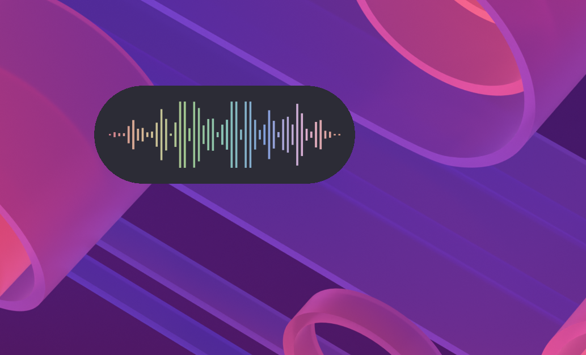

# Animation Speech

**Easy to integrate into your Bash or Python scripts.**

Configurable transparent overlay for Wayland that displays visual animations during speech. Controlled via UNIX signals, making it easy to integrate with any TTS, STT, or audio backend.


https://github.com/user-attachments/assets/4aff68b7-174d-4485-b823-671fd3426835


<p align="center">
  
  <br>
  <em>Overlay with rounded background — displayed over KDE desktop</em>
</p>

## How it works

```
┌──────────────┐  animation-speech-ctl  ┌──────────────────┐
│  Your app    │ ────────────────────── │  animation-speech │
│  (TTS, STT)  │   start / stop / quit  │  (Wayland overlay)│
└──────────────┘ ────────────────────── └──────────────────┘
      Speaking → start                      Animation visible
      Silence  → stop                       Animation hidden
```

The animation runs as a standalone background process. Control it with `animation-speech-ctl`:
- **`animation-speech-ctl start`** — start the animation (sends SIGUSR1)
- **`animation-speech-ctl stop`** — stop the animation (sends SIGUSR2)
- **`animation-speech-ctl launch`** — launch the process if needed, then start

Or send signals directly: `kill -SIGUSR1 $(cat "$PID_FILE")` / `kill -SIGUSR2 $(cat "$PID_FILE")`

## Features

- **True Wayland overlay** via gtk-layer-shell (not a regular window)
- **Fully transparent** — only the animation is visible
- **8 animation types** — wave, equalizer, soundwave, soundwave-curve, circular, circular-wave, circular-bars, particles
- **Rounded background** — optional semi-transparent capsule-style backdrop
- **Microphone modulation** — animation reacts to mic input via PyAudio (optional)
- **Mute detection** — automatic warning when mic is muted (PulseAudio/PipeWire/ALSA)
- **Multi-format colors** — hex (`#ED8796`), hex+alpha (`#ED8796F2`), short hex (`#F00`), float arrays
- **Visual selector** — `--choose` to preview and pick configs interactively
- **9 screen positions** — bottom, top, center, corners
- **i18n** — English and French

## Installation

### Debian/Ubuntu

```bash
sudo dpkg -i animation-speech_1.2.0_all.deb
sudo apt-get install -f   # install missing dependencies
```

### Other distributions

```bash
tar xzf animation-speech-1.2.0.tar.gz
cd animation-speech-1.2.0
./install.sh              # user install (~/.local)
./install.sh --system     # system-wide (/usr/local, needs sudo)
./install.sh --uninstall  # uninstall
```

### Dependencies

<details>
<summary><strong>Debian/Ubuntu</strong></summary>

```bash
sudo apt install python3-gi python3-gi-cairo gir1.2-gtk-3.0 python3-yaml \
                 gtk-layer-shell gir1.2-gtklayershell-0.1
# Optional: microphone modulation
sudo apt install python3-pyaudio
```
</details>

<details>
<summary><strong>Arch Linux</strong></summary>

```bash
sudo pacman -S python-gobject gtk3 python-yaml gtk-layer-shell
# Optional: sudo pacman -S python-pyaudio
```
</details>

<details>
<summary><strong>Fedora</strong></summary>

```bash
sudo dnf install python3-gobject gtk3 python3-pyyaml gtk-layer-shell
# Optional: sudo dnf install python3-pyaudio
```
</details>

> Without gtk-layer-shell, the program falls back to a regular window instead of a transparent overlay.

## Quick start

```bash
# Launch (waits for signals)
animation-speech &

# Start / stop / quit
PID_FILE="${XDG_RUNTIME_DIR:-/tmp}/speech-animation.pid"
kill -SIGUSR1 $(cat "$PID_FILE")   # start
kill -SIGUSR2 $(cat "$PID_FILE")   # stop
kill $(cat "$PID_FILE")            # quit
```

Or use the control script:

```bash
animation-speech-ctl start     # SIGUSR1
animation-speech-ctl stop      # SIGUSR2
animation-speech-ctl toggle    # SIGUSR1 (toggle)
animation-speech-ctl launch    # launch if needed, then start
animation-speech-ctl quit      # SIGTERM
animation-speech-ctl status
```

## Command-line options

```
animation-speech [config] [OPTIONS]

  -w, --width PX         Animation width in pixels
  -H, --height PX        Animation height in pixels
  -p, --position POS     Screen position (top, bottom, center, top-left, etc.)
  -mt/-mb/-ml/-mr PX     Margins (top, bottom, left, right)
  -s, --speed N          Speed (0.5=slow, 2=normal, 5=fast)
  -c, --count N          Number of curves/circles
  --bg / --no-bg         Enable/disable rounded background
  --bg-opacity N         Background opacity (0.0–1.0)
  -a, --audio            Enable microphone modulation
  --sensitivity N        Microphone sensitivity
  --on-escape CMD        Shell command on Escape key (enables keyboard grab)
  -l, --list             List available configurations
  --choose [FILTER]      Open visual selector
```

CLI options override YAML config values:

```bash
animation-speech monochrome-bw -w 1200 -H 100 -mb 30 --bg
```

## Configuration

Main config file: `config.yaml`

```yaml
animation_type: wave       # wave, equalizer, soundwave, soundwave-curve,
                           # circular, circular-wave, circular-bars, particles
position: bottom           # bottom, top, center, top-left, top-right, etc.
width: 800
height: 60

colors:
  background: "#00000000"              # Transparent
  primary: "#ED8796"                   # Hex RGB
  secondary: "#8AADF4F2"              # Hex RGBA
  gradient:
    - "#ED8796F2"
    - "#EED49FF2"
    - "#A6DA95F2"
    - "#8BD5CAF2"

background:                            # Rounded backdrop (optional)
  enabled: true
  color: [0.2, 0.2, 0.25, 0.85]
  padding: 10
  border_width: 2
  border_color: "#FFFFFF80"

audio:                                 # Microphone modulation (optional)
  enabled: false
  sensitivity: 1.5
  smoothing: 0.3

animation:
  fps: 60
  bar_count: 20
  smoothing: 0.3
  intensity: 1.0
```

### Color formats

| Format | Example | Alpha |
|---|---|---|
| Hex RGB | `"#ED8796"` | 1.0 (default) |
| Hex RGBA | `"#ED8796F2"` | Included |
| Short hex | `"#F00"` | 1.0 (default) |
| Float array | `[0.93, 0.53, 0.59, 0.95]` | Included |

### Bundled configs

Configs are in `config.examples/` (with audio) and `config.examples/no-audio/`.

```bash
animation-speech --list                    # list all
animation-speech monochrome-bw             # use by name
animation-speech --choose                  # interactive selector
animation-speech --choose kurve            # filtered selector
```

## Integration examples

Display an animation while a TTS engine speaks or while an STT engine listens.

<details>
<summary><strong>Bash + Piper TTS</strong></summary>

```bash
#!/bin/bash
TEXT="$1"
PID_FILE="${XDG_RUNTIME_DIR:-/tmp}/speech-animation.pid"

# Start the overlay if not already running
if [ ! -f "$PID_FILE" ] || ! kill -0 "$(cat "$PID_FILE")" 2>/dev/null; then
    animation-speech &
    sleep 0.3
fi

ANIM_PID=$(cat "$PID_FILE")
kill -SIGUSR1 "$ANIM_PID"
echo "$TEXT" | piper --model en_US-lessac-medium --output-raw | aplay -r 22050 -f S16_LE -q
kill -SIGUSR2 "$ANIM_PID"
```

```bash
./tts-speak.sh "Hello, this is a speech synthesis test"
```
</details>

<details>
<summary><strong>Bash + espeak-ng</strong></summary>

```bash
#!/bin/bash
PID_FILE="${XDG_RUNTIME_DIR:-/tmp}/speech-animation.pid"
animation-speech &
sleep 0.3
ANIM_PID=$(cat "$PID_FILE")

speak() {
    kill -SIGUSR1 "$ANIM_PID"
    espeak-ng -v en "$1"
    kill -SIGUSR2 "$ANIM_PID"
}

speak "First sentence."
sleep 1
speak "Second sentence after a pause."
kill "$ANIM_PID"
```
</details>

<details>
<summary><strong>Python + gTTS</strong></summary>

```python
#!/usr/bin/env python3
import os, signal, subprocess, time
from gtts import gTTS

PID_FILE = os.path.join(os.environ.get('XDG_RUNTIME_DIR', '/tmp'), 'speech-animation.pid')

def get_animation_pid():
    try:
        with open(PID_FILE) as f:
            pid = int(f.read().strip())
        os.kill(pid, 0)
        return pid
    except (FileNotFoundError, ValueError, ProcessLookupError):
        return None

def start_animation():
    subprocess.Popen(["animation-speech"])
    time.sleep(0.3)
    return get_animation_pid()

def speak(text, lang="en", anim_pid=None):
    if anim_pid is None:
        anim_pid = get_animation_pid()
    tts = gTTS(text=text, lang=lang)
    tts.save("/tmp/tts_output.mp3")
    os.kill(anim_pid, signal.SIGUSR1)
    subprocess.run(["mpv", "--no-video", "/tmp/tts_output.mp3"],
                   stdout=subprocess.DEVNULL, stderr=subprocess.DEVNULL)
    os.kill(anim_pid, signal.SIGUSR2)

if __name__ == "__main__":
    pid = start_animation()
    speak("Hello, this is a test.", anim_pid=pid)
    time.sleep(1)
    speak("The animation adapts automatically.", anim_pid=pid)
    os.kill(pid, signal.SIGTERM)
```
</details>

<details>
<summary><strong>STT recording with Escape to cancel</strong></summary>

```bash
#!/bin/bash
# --on-escape: pressing Escape cancels the recording
animation-speech --on-escape "kill $$ && rm -f /tmp/recording.wav" &
sleep 0.3
ANIM_PID=$(cat "${XDG_RUNTIME_DIR:-/tmp}/speech-animation.pid")

kill -SIGUSR1 "$ANIM_PID"
arecord -d 5 -f cd /tmp/recording.wav
kill -SIGUSR2 "$ANIM_PID"
kill "$ANIM_PID"

whisper /tmp/recording.wav --language en --model small
```
</details>

<details>
<summary><strong>Conversational loop (STT + TTS)</strong></summary>

```bash
#!/bin/bash
animation-speech -a &   # -a: mic modulation
sleep 0.3
ANIM_PID=$(cat "${XDG_RUNTIME_DIR:-/tmp}/speech-animation.pid")

while true; do
    echo "=== Listening... ==="
    kill -SIGUSR1 "$ANIM_PID"
    arecord -d 5 -f cd /tmp/input.wav 2>/dev/null
    kill -SIGUSR2 "$ANIM_PID"

    TEXT=$(whisper /tmp/input.wav --language en --model small 2>/dev/null | tail -1)
    echo "You: $TEXT"
    [ "$TEXT" = "quit" ] && break

    RESPONSE="You said: $TEXT"
    kill -SIGUSR1 "$ANIM_PID"
    espeak-ng -v en "$RESPONSE"
    kill -SIGUSR2 "$ANIM_PID"
    echo "Assistant: $RESPONSE"
done

kill "$ANIM_PID"
```
</details>

## Building from source

```bash
git clone https://github.com/rcspam/animation-speech.git
cd animation-speech
./animation-speech.py             # run directly (dev mode)
python3 -m animation_speech       # run as Python module

make build                        # build zipapp → animation-speech.pyz
make dist                         # build tarball → animation-speech-1.2.0.tar.gz
cd debian && ./build-deb.sh       # build .deb package

make pot && make update-po        # update translations
make mo                           # compile translations
make stats                        # translation statistics
```

## Architecture

```
animation_speech/
    __init__.py          — version
    __main__.py          — entry point (zipapp + python -m)
    constants.py         — constants, palettes, valid types
    utils.py             — i18n, parse_color, normalize_config_colors
    draw_mixin.py        — AnimationDrawMixin (Cairo, 8 drawing types)
    animation.py         — SpeechAnimation + AnimationPreview
    gradient_editor.py   — GradientEditor (GTK3 widget)
    config_editor.py     — ConfigEditor (config editor with live preview)
    config_chooser.py    — ConfigChooser (visual FlowBox selector)
    main.py              — argparse, config discovery, entry point
```

## License

[GNU General Public License v3.0](LICENSE)
